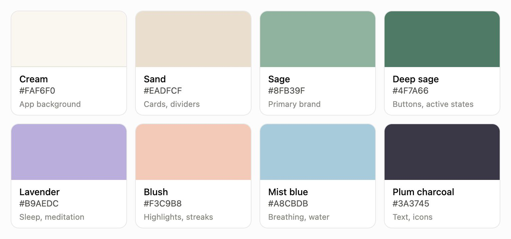

# CareBuddy branding

Use **CareBuddy** as one word, with a capital C and B, in all product names, headings, descriptions and accessibility labels.

## Colour palette

| Colour | Hex | Use |
| --- | --- | --- |
| Cream | `#FAF6F0` | App and landing-page backgrounds |
| Sand | `#EADFCF` | Cards and dividers |
| Sage | `#8FB39F` | Primary brand colour |
| Deep sage | `#4F7A66` | Buttons and active states |
| Lavender | `#B9AEDC` | Sleep and meditation |
| Blush | `#F3C9B8` | Highlights and streaks |
| Mist blue | `#A8CBDB` | Breathing and water |
| Plum charcoal | `#3A3745` | Text and icons |

The palette image is the original supplied artwork. Machine-readable values are in [carebuddy-brand.json](carebuddy-brand.json).

## Website typography

Use **Fraunces** for headings and **DM Sans** for body text, captions, navigation, buttons and form controls.

| Role | Font | Local file |
| --- | --- | --- |
| Headings | Fraunces | [Fraunces.ttf](fonts/Fraunces.ttf) |
| Body and UI | DM Sans | [DM-Sans.ttf](fonts/DM-Sans.ttf) |

Both font families include their original SIL Open Font License files in [fonts/](fonts/). Preserve those licences when distributing the fonts.

Keep the existing fonts in PowerPoint and PDF presentations; update their product name to CareBuddy.

The website serves these font files from `public/fonts/`, including them in the app's offline cache.

## Logo assets

Use the approved artwork without stretching its proportions:

- [Original logo](carebuddy-original.png)
- [Full logo](../../public/branding/carebuddy-logo-v1.png)
- [Wordmark](../../public/branding/carebuddy-wordmark-v1.png)
- [Symbol](../../public/branding/carebuddy-symbol-v1.png)

The app and landing page use the palette and font pairing above. Technical identifiers such as package names, storage keys and MCP server IDs remain stable so existing care data and integrations continue to work.

## Project cover

Use the [380 × 216 project cover or 16:9 master](covers/README.md) for the CareBuddy submission or project thumbnail.
