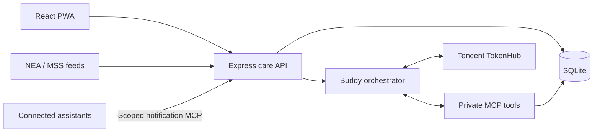

# Architecture

CareBuddy uses a React/TypeScript PWA, an Express backend and SQLite. The backend serves the frontend, owns care-state writes and keeps provider credentials out of the browser. Nginx terminates HTTPS in the deployed environment.

## Care state and writes

A browser sends its client reference and selected profile. The backend enforces browser visibility and profile permissions, loads that browser's saved records, and rejects cross-browser requests.

Forms use typed `/api/commands` requests. Commands validate the record, recurrence, permissions and expected revision before an atomic SQLite save. Stable action IDs prevent repeated requests from creating duplicate writes. Whole-state overwrites are disabled; bootstrap can initialize only an empty revision-zero care space.

The browser renders authoritative server responses and retains a scoped display cache. Request queues and profile-selection checks prevent delayed responses from publishing another person's results. The live clock projects Singapore time and materializes current-day routines; explicit demo controls can use a reference clock.

## Buddy agent

`POST /api/buddy/interpret` accepts a request ID, message, selected profile and optional owned record context. The server assembles selected reminder, appointment and benefit context through an in-memory MCP connection. TokenHub receives the supported tool schemas and a prompt defining the conversational and care boundaries.

A model-selected tool is validated independently in code. Clear supported requests save automatically, together with chat messages and a saved receipt, in one transaction. Missing information, unsupported actions, view-only access and invalid times stop the write. Request IDs bind retries to the original payload and result.

No arbitrary SQL tool is exposed. Health-vitals readings, sleep content and weather are separate from Buddy's selected-care model context. Medication instructions remain recorded care directions; healthcare professionals retain clinical decisions.

## Other integrations

| Integration | Implementation |
| --- | --- |
| Weather | Backend fetches NEA/MSS public feeds; frontend provides loading, retry, PSI and rain prompts |
| Health | SQLite holds illustrative vitals per browser/profile; visible screens refresh through the API |
| Sleep | Frontend fixture supplies duration, stage breakdown and review content |
| WhiteCoat | A fixed external GP link opens after the user chooses the handoff |
| Assistant plugins | Scoped MCP notification tools read alerts and acknowledge delivery IDs only |
| WorkBuddy packages | Optional deterministic preparation packages propose changes for the app to validate |

Assistant plugin credentials are hashed in SQLite, expire after 90 days and can be revoked. Checks revalidate browser visibility and profile access. Installation alone does not create a schedule; the host assistant must schedule checks.

## Prototype boundaries

The browser reference is a namespace, not verified human identity. Family, benefit, appointment and health records are fictional. Device feeds, verified accounts, consent-verified sharing and clinical evaluation remain future integrations.

See [TokenHub setup](tokenhub.md), [browser access](client-access.md) and [deployment](../DEPLOYMENT.md).
